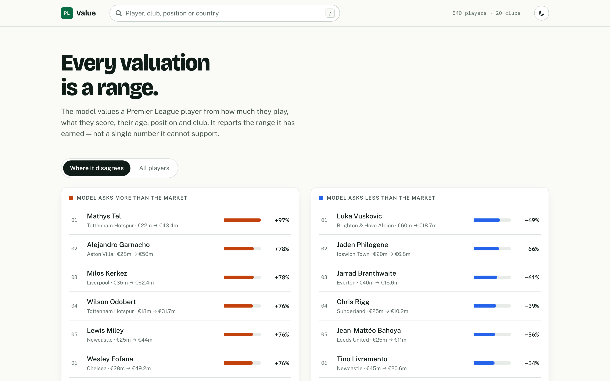
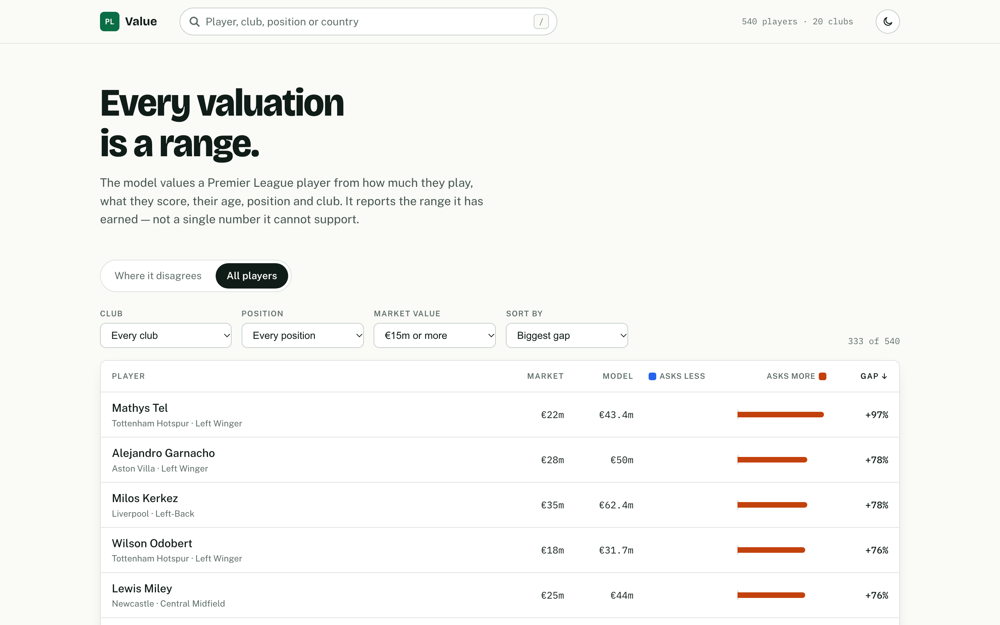
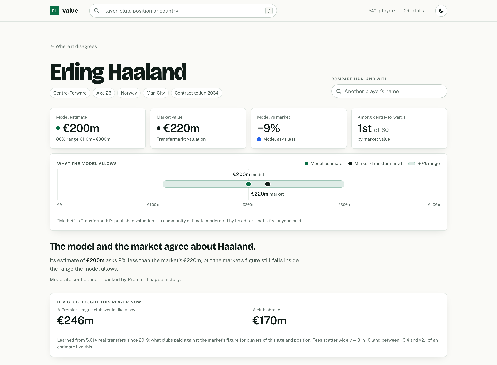
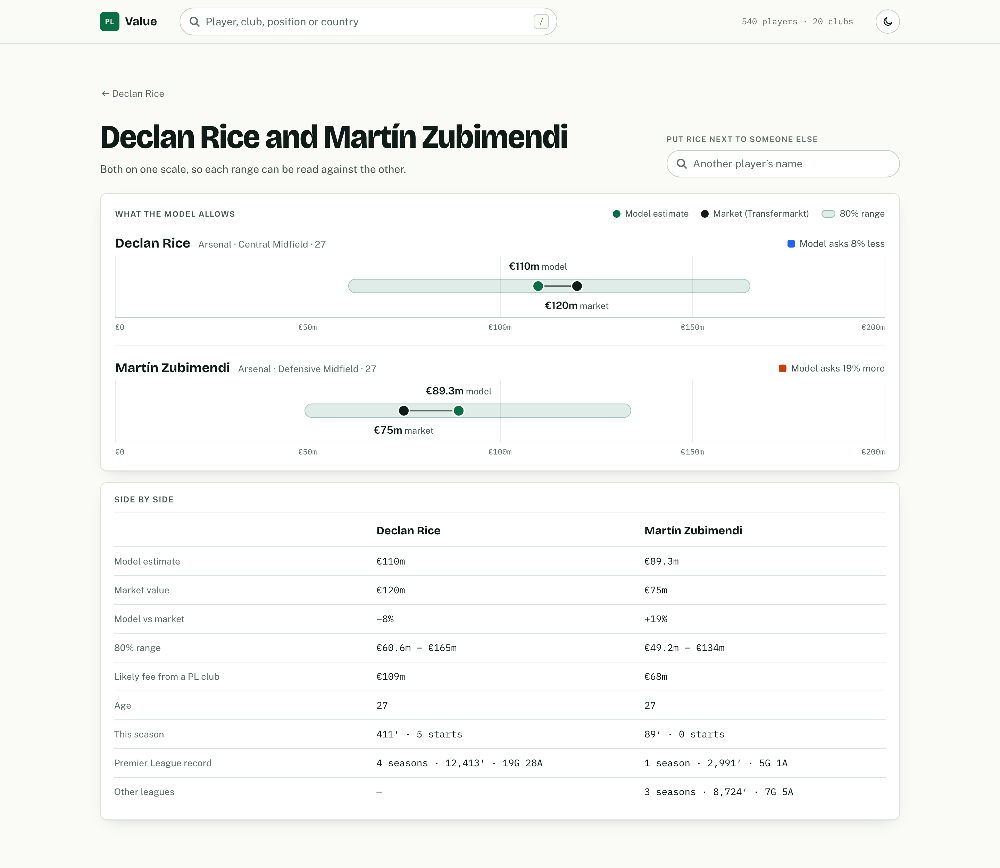
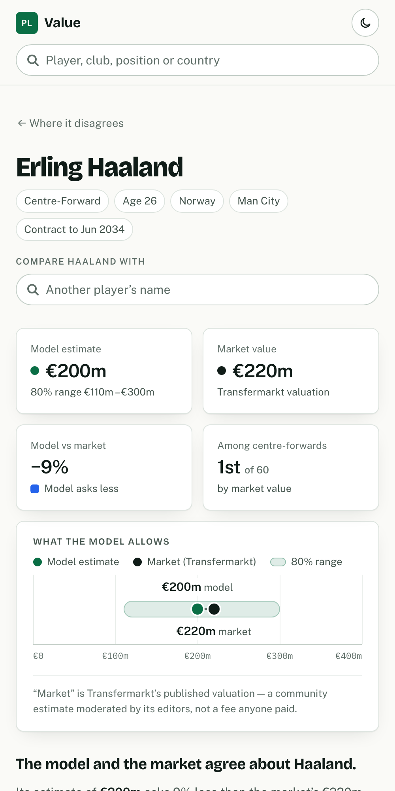
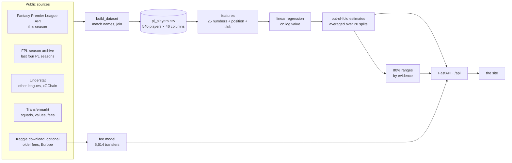

<div align="center">

# PL Value

**What every Premier League player is worth, shown as a range next to the market's figure.**

[](https://github.com/mlodyheros/pl-value-predictor/actions/workflows/tests.yml)


[](LICENSE)

[Quick start](#quick-start) · [Using the site](#using-the-site) · [How it works](#how-the-engine-works) · [The data](#the-data) · [API](#api) · [Model notes](docs/model.md) · [Data reference](docs/data.md)

</div>

<picture>
  <source media="(prefers-color-scheme: dark)" srcset="docs/images/board-dark.png">
  
</picture>

PL Value estimates the market value of all **540 players** in this season's
Premier League squads from what they actually do: how much they play, what they
produce, how old they are, where and for whom they play, and what a club last
paid for them. It sets that estimate beside
[Transfermarkt](https://www.transfermarkt.com)'s valuation and shows how far
the two disagree.

What sets it apart from a single "predicted price":

- **A range, not a number.** Every estimate carries an 80% range measured from
  the model's own errors. A player with years of Premier League history gets a
  tighter range than a summer signing no source covers, and the ranges are
  checked: on players the model has not seen they contain the real value 79–80%
  of the time.
- **Honest scoring.** Each player is valued by models that never saw him
  (out-of-fold), averaged over 20 random splits, so no estimate flatters itself
  and none hangs on the luck of one split.
- **A second opinion on price.** A separate model, learned from 5,614 real
  transfers, estimates what a Premier League club, or one abroad, would
  actually pay.
- **Checked by a person.** A reader marked where the model was wrong, club by
  club. Those 28 judgements are a test the model has to keep passing.
- **No keys, no accounts.** Every source is public, and the data refreshes
  itself after each gameweek.

| | |
|---|---|
| **Players** | 540 in 20 squads, 2026/27 season |
| **Accuracy** (5-fold cross-validation) | R² 0.83 on log value · average miss €5.9m · typical miss 28% |
| **Ranges** | the 80% range contains the market value for 430 of 540 players |
| **Stack** | Python 3.11 · pandas · scikit-learn · FastAPI · plain HTML/CSS/JS, no build step |

## Contents

- [Quick start](#quick-start)
- [Using the site](#using-the-site)
- [How the engine works](#how-the-engine-works)
- [The data](#the-data)
- [API](#api)
- [Command line](#command-line)
- [Project structure](#project-structure)
- [Tests](#tests)
- [Limitations](#limitations)
- [Credits and terms](#credits-and-terms)

## Quick start

You need Python 3.11 and an internet connection for the first build. On macOS,
clone outside Desktop, Documents and Downloads (for example into `~/projects`),
because the daily refresh cannot read those folders.

```bash
git clone https://github.com/mlodyheros/pl-value-predictor.git
cd pl-value-predictor
python3.11 -m venv .venv
source .venv/bin/activate          # on Windows: .venv\Scripts\activate
pip install -r requirements.txt
```

**Optional, recommended:** download the free
[Transfermarkt datasets on Kaggle](https://www.kaggle.com/datasets/davidcariboo/player-scores)
and put `players.csv`, `transfers.csv`, `player_valuations.csv`,
`appearances.csv` and `competitions.csv` in `data/raw/kaggle/`. They add
earlier transfer fees, Champions League minutes and the fee model. Without them
everything still runs, and those parts are simply left out.

Then build, train and serve:

```bash
python -m backend.sources.build_dataset   # fetch and join the sources  → data/processed/pl_players.csv
python -m backend.model                   # train the model, measure its ranges → models/
python -m backend.fee_model               # train the fee model (needs the Kaggle files)
uvicorn backend.api:app --port 8000       # serve the site and the API
```

Then open **http://localhost:8000**.

The first build downloads everything and takes a few minutes, mostly because
Transfermarkt is asked politely, one page every 2.5 seconds. Every response is
cached in `data/raw/`, so later builds take seconds.

## Using the site

### The board: where the model and the market disagree

The home page opens on two lists: the players the model values **above** the
market (orange) and **below** it (blue), largest gap first. The length of the
bar is the size of the gap. Players worth under €15m are left out here, because
a percentage gap on a cheap squad player is mostly noise. The link under the
lists continues them through every player above that line.

### All players

<picture>
  <source media="(prefers-color-scheme: dark)" srcset="docs/images/table-dark.png">
  
</picture>

Every player in one table: the market value, the model's estimate, and a bar
centred on "no disagreement" that grows right when the model asks more and left
when it asks less.

- **Filter** by club, position and market value.
- **Sort** by clicking a column header, and click it again to reverse the order.
  The header stays in view as you scroll.
- **Open** a player by clicking the row. Coming back puts you on the same row,
  briefly highlighted.
- The filters and the order are part of the address, so a view can be bookmarked
  or shared, for example `/#all?club=Arsenal&sort=gap`.

### A player's page

<picture>
  <source media="(prefers-color-scheme: dark)" srcset="docs/images/player-dark.png">
  
</picture>

From top to bottom:

1. **Four tiles.** The model's estimate with its 80% range, Transfermarkt's
   value, the gap between them, and where the player ranks by value in his
   position.
2. **What the model allows.** The range is a green band on a euro scale that
   starts at zero. The model's estimate is the green dot and the market's
   figure the dark one. When the dark dot sits inside the band, the model and
   the market agree, as far as the model can tell.
3. **The verdict.** Whether they agree, by how much, and how confident the model
   is. A plain-English note appears when something is known to distort the
   figure: a recent fee the market's valuation has not caught up with, a player
   missing from this season's squad list, or no minutes on record at all.
4. **If a club bought this player now.** The fee model's estimate for a Premier
   League buyer and for one abroad, how widely real fees scatter, and a warning
   when a short contract would pull the price down.
5. **Minutes by season.** Each of the last four seasons against every minute of
   a 38-game season, and this season against the games played so far.
6. **Against other players in his position.** Everyone in the same position is a
   dot on a log scale of value. Hover to see who, and click to open them.
7. **What the model had to go on.** The evidence behind the estimate: this
   season, the Premier League record, other leagues and the last fee.

### Comparing two players

<picture>
  <source media="(prefers-color-scheme: dark)" srcset="docs/images/compare-dark.png">
  
</picture>

Type a name into **Compare … with** at the top of any player's page. Both
ranges are drawn on one shared scale, with the figures side by side underneath.
The box at the top swaps in someone else.

### Good to know

- Press <kbd>/</kbd> anywhere to jump to the search. <kbd>↑</kbd> <kbd>↓</kbd>
  move through the matches, <kbd>Enter</kbd> opens one and <kbd>Esc</kbd>
  closes the list. Each match already shows market value → model estimate and
  the gap.
- The moon/sun button switches between the light and dark themes and remembers
  your choice. Until you use it, the page follows your system setting.
- Every view has its own address: a player is `/#p406`, a comparison
  `/#c13,11`. Back always works, and anything can be bookmarked.
- It works on a phone:

<p align="center">
  <picture>
    <source media="(prefers-color-scheme: dark)" srcset="docs/images/phone-dark.png">
    
  </picture>
</p>

## How the engine works



**1. Collect and join.** `backend/sources/` fetches each source and caches
every response. `build_dataset.py` then joins them into one row per player. The
hard part is names: FPL writes "Benjamin White" where Transfermarkt writes "Ben
White", Understat writes "Mathis Cherki" for Rayan Cherki, and several players
are just "Gabriel". Names are transliterated and matched exactly first. Looser
rules apply only among the player's own club. See
[how the sources are joined](docs/data.md#how-the-sources-are-joined).

**2. Describe each player in numbers.** `features.py` turns the raw columns into
25 numeric features plus position and club:

| What | Features |
|---|---|
| Age | age, age², and hinges at 23 and 29: value rises into the mid-20s and bends down after 29 |
| Playing time | share of this season's minutes, of last season's, and of the last four seasons'; how far last season fell short of the player's own level |
| Output and quality | goals + assists per 90; xGChain per 90 against the position's average; output × minutes |
| Europe | Champions League matches (minutes ÷ 90) last season |
| Price | the last transfer fee (log), whether there is one, and how long ago it was paid |
| Context | not playing this season × career and × fee; young regulars; older regulars; backup goalkeepers |
| What is known | in this season's FPL list; has a PL record; has any record; has a quality record |
| Where | position (12) and club (20), one-hot |

**3. Fit.** A scikit-learn pipeline standardises the numbers, one-hot encodes
position and club, and fits a **linear regression on log(1 + value)**. Values are
heavily skewed and errors are proportional, so log is the natural scale. Each
player is weighted by √value, so the €100m players count for more than they
would in a plain log fit, without drowning everyone else. The linear model beat
random forests and gradient boosting on euro error, and it can be written down:
see [the fitted equation](docs/model.md#the-fitted-model).

**4. Score honestly.** A model asked about players it trained on flatters
itself, and "is this player over-valued?" is exactly the question that flattery
would corrupt. So every figure on the site comes from models fitted without that
player (5-fold, out-of-fold), averaged over 20 random splits. With a single
split, a player's figure moved by about 6% depending on who happened to share
his fold, and Haaland came out anywhere from €181m to €230m. Averaged, the
movement is about 1%.

**5. Measure the uncertainty.** The out-of-fold errors, grouped by the evidence
behind each player, become the ranges:

| What backs the estimate | Players | 80% range | Shown as |
|---|---|---|---|
| Premier League history | 424 | ×0.55 – ×1.50 | moderate confidence |
| Other big European leagues only | 60 | ×0.47 – ×1.63 | moderate confidence |
| No record in any covered league | 56 | ×0.30 – ×1.80 | low confidence |

Calibrated on training folds and tested on held-out ones, the 80% range contains
the true value 79–80% of the time, and the 50% range 48–51%.

**6. Price a transfer.** `fee_model.py` is a second, separate model. It predicts
the log fee from the log market value, an age curve, the position, whether buyer
and seller are Premier League clubs, and the year. It learned from 5,614 paid
transfers since July 2019. Premier League buyers pay about ×1.25 the market's
figure, young players go for more and older ones for less. On sales by PL clubs
its typical miss is ×1.39, against ×1.43 for "fee = market value". On PL-to-PL
deals it is ×1.27 against ×1.43. Eight fees in ten land between ×0.43 and ×2.14
of its estimate.

**7. Keep a person in the loop.** A reader went squad by squad marking where the
model was wrong: 28 players at Arsenal, Man Utd, Liverpool, Man City and
Bournemouth. The labels live in
[`human_labels.csv`](backend/tests/fixtures/human_labels.csv), and a test fails
if a change turns the errors they flagged the other way. At least 80% must
still agree, and today 82% do. They caught the age curve and the misreading of
injured players, which no aggregate metric had.

### How good is it?

| Measure, 5-fold cross-validation | |
|---|---|
| R² on log value | 0.83 |
| Average miss (MAE) | €5.9m |
| Typical miss (median, as a ratio) | 28% |
| Average miss among the dearest 10% | €13.1m |

Where it is weakest:
- **It pulls extremes toward the middle.** It asks a median 1.7× the market for
  players under €5m and 0.95× for those above €20m. Haaland, at €220m worth
  nearly twice anyone else in the league, gets €200m.
- **Players with no record anywhere are the hardest.** For the 56 players with
  no record in any covered league, the typical miss is 48%, against 27% for
  everyone else.

The full story is in **[docs/model.md](docs/model.md)**: the fitted equation with
every coefficient, a worked example, what each feature was worth, and
everything tried and rejected.

## The data

There is no database server. The "database" is a set of plain files that the
pipeline writes and the API reads, easy to inspect, back up or delete:

| Layer | Where | What is in it |
|---|---|---|
| Raw cache | `data/raw/<source>/` | every API response and page exactly as fetched; later builds reuse it |
| The dataset | `data/processed/pl_players.csv` | one row per player in a current Premier League squad: 540 rows × 46 columns |
| Trained models | `models/` | the value model and the fee model (`.joblib`), and the measured ranges (`.json`) |

All three are built on your machine by the commands above and are not in git.
The API loads the dataset and the models when it starts. If the dataset is
rebuilt, the API notices on the next request, without a restart.

### Sources

| Source | What it provides | How it is read | Refreshed |
|---|---|---|---|
| [Fantasy Premier League API](https://fantasy.premierleague.com/api/bootstrap-static/) | the 20 clubs; this season's minutes, starts and gameweeks | public JSON, no key | every 24 hours |
| [vaastav/Fantasy-Premier-League](https://github.com/vaastav/Fantasy-Premier-League) | the last four completed PL seasons (2022/23 to 2025/26): minutes, starts, goals, assists | one CSV per season | fetched once |
| [Understat](https://understat.com) | seasons in La Liga, the Bundesliga, Serie A, Ligue 1 and the Russian league; xGChain in those and the PL | public league pages | fetched once |
| [Transfermarkt](https://www.transfermarkt.com) | squads, **market values** (what the model predicts), age, position, nationality, contracts, this season's fees | public squad and transfer pages, one request every 2.5 s | weekly |
| [Kaggle: Transfermarkt datasets](https://www.kaggle.com/datasets/davidcariboo/player-scores) *(optional)* | earlier fees, Champions League minutes, league minutes where Understat spells a name differently, and the transfers the fee model learns from | a one-off CSV download | when you replace it |

### What one row holds

| Columns | From | Meaning |
|---|---|---|
| `name`, `club`, `position`, `age`, `nationality`, `contract_expiry` | Transfermarkt | who the player is |
| `market_value_eur` | Transfermarkt | the value being predicted |
| `fpl_minutes`, `fpl_starts`, `fpl_gameweeks`, `has_fpl_record` | FPL API | this season so far |
| `hist_minutes`, `hist_goals`, `hist_assists`, `hist_seasons`, `recent_minutes`, … | FPL archive | the last four PL seasons, and the newest one on its own |
| `nonpl_minutes`, `nonpl_goals`, `nonpl_assists`, `nonpl_seasons`, … | Understat, else Kaggle | the same record in the other big leagues |
| `us_minutes`, `us_xgchain` | Understat | the inputs to the quality measure |
| `cl_minutes_last` | Kaggle | Champions League minutes last season |
| `transfer_fee_eur`, `transfer_fee_date`, `transfer_fee_years` | Transfermarkt, else Kaggle | the last fee paid for the player |

Every column is described in **[docs/data.md](docs/data.md)**, together with
how the sources are matched and how the data stays current.

### Keeping it current

```bash
python -m backend.refresh              # rebuild and retrain, but only if something changed
python -m backend.refresh --force      # rebuild regardless
./scripts/install_refresh_schedule.sh  # check every day at 07:00 (macOS)
```

The refresh rebuilds when a gameweek has finished since the last build, or when
Transfermarkt's pages are a week old. Otherwise it asks FPL one question and
stops. A running site picks up the new data on its next request.

## API

The site talks to the model only through a small JSON API. Interactive docs are
at `/api/docs`.

| Endpoint | Returns |
|---|---|
| `GET /api/players` | every player: id, name, club, position, age, market value, model estimate, gap, evidence tier |
| `GET /api/players/{id}` | one player in full: the range and whether the market falls in it, confidence, fee estimate, minutes by season, peers and evidence |
| `GET /api/rankings?limit=10&min_value_eur=15000000` | the largest gaps in each direction |
| `GET /api/meta` | dataset size, clubs, positions, seasons, model accuracy and the range for each evidence tier |

```bash
curl -s localhost:8000/api/players/406
```

Abridged:

```json
{
  "name": "Erling Haaland",
  "club": "Man City",
  "position": "Centre-Forward",
  "age": 26,
  "marketValueEur": 220000000,
  "predictedEur": 200058109,
  "gapPct": -9.06,
  "range": { "lowEur": 110199830, "highEur": 300426705 },
  "marketInRange": true,
  "confidence": { "tier": "pl_history", "summary": "moderate confidence - backed by Premier League history" },
  "feeEstimate": { "premierLeagueEur": 245904074, "abroadEur": 170259024, "lowMultiple": 0.43, "highMultiple": 2.14 },
  "peers": { "position": "Centre-Forward", "count": 60, "valuePercentile": 0.983 },
  "evidence": {
    "thisSeason": { "minutes": 450, "starts": 5, "gameweeks": 5 },
    "premierLeague": { "seasons": 4, "minutes": 11009, "goals": 112, "assists": 28 }
  }
}
```

## Command line

```bash
# One player: the same figure as the site, with the range and the evidence behind it
python -m backend.predict --player "Erling Haaland"

# A player who does not exist, from the few things you know about him
python -m backend.predict --age 24 --position "Centre-Forward" --club "Man City" \
    --minutes-share 0.9 --career-minutes-share 0.85 --career-gi-per90 0.8
```

```
Erling Haaland (Man City, Centre-Forward, age 26)
  This season (FPL): 450 minutes, 5 starts
  Past 4 PL season(s): 11009 minutes, 112G 28A
  Actual value:    €220,000,000
  Predicted value: €200,058,109  (-9.1% vs actual)
  Confidence:      moderate confidence - backed by Premier League history
  80% range:       €110,199,830 - €300,426,705
```

`notebooks/01_model_exploration.ipynb` walks through the data, the model and the
experiments behind it. It needs `pip install -r requirements-dev.txt` and a
built dataset.

## Project structure

```
backend/
  api.py                    the HTTP API, and the only thing the site talks to
  config.py                 paths, seasons, sources and politeness settings
  features.py               the 25 features, each explained with what it was worth
  model.py                  train, cross-validate, out-of-fold estimates
  confidence.py             the measured ranges, by what backs each estimate
  fee_model.py              the second model: what a club would pay
  predict.py                the command-line lookup
  refresh.py                rebuild and retrain when something has changed
  evaluate.py               predicted-vs-actual plot → reports/figures/
  sources/
    fpl_client.py           FPL API: clubs and this season
    fpl_archive_client.py   past PL seasons, one CSV per season
    understat_client.py     other leagues, and xGChain for everyone
    transfermarkt_scraper.py  squads, values and this season's fees (cached, rate-limited)
    transfer_fees.py        earlier fees, from the optional Kaggle download
    kaggle_appearances.py   Champions League and league minutes, from the same download
    names.py                name normalisation shared by every join
    build_dataset.py        joins everything into data/processed/pl_players.csv
  tests/                    216 tests, no network; fixtures/human_labels.csv
frontend/
  index.html                one page, no build step
  assets/                   app.js (what to show), charts.js (drawing), styles.css
docs/                       model notes, data reference, screenshots
notebooks/                  exploration and the experiment log
scripts/                    install or remove the daily refresh (macOS)
data/                       raw cache and the built dataset (not in git)
models/                     trained models and ranges (not in git)
```

The interface has its own notes on design and accessibility in
[frontend/README.md](frontend/README.md).

## Tests

```bash
pip install -r requirements-dev.txt
pytest
```

216 tests, none of which touch the network. The human-labels test needs a built
dataset and is skipped without one. GitHub Actions runs the suite on every
push.

## Limitations

- **"Market value" is Transfermarkt's estimate**, a community figure moderated
  by its editors, not a fee anyone paid. The model learns to predict that
  estimate. The fee model is the part that speaks to real prices.
- **Some newcomers have no record anywhere.** The Championship, Portugal and the
  Eredivisie are not covered by any source the pipeline can reach, so 56
  players are valued from age, position, club and fee alone. They are labelled
  low confidence and given a wide range instead of a falsely precise number.
- **The model cannot see form or contracts.** A player out of form, or with a
  year left on his deal, looks the same to it as anyone else with his record.
- **Early in a season this season counts for little.** After five gameweeks,
  history carries most of the weight. Retrain as the season goes on (the
  refresh does it for you).
- **Valuations can lag by up to a week**, since Transfermarkt's pages are cached
  for seven days.

More, with measurements, in [docs/model.md](docs/model.md#what-is-left) and
[docs/data.md](docs/data.md#known-gaps).

## Credits and terms

Data comes from the [Fantasy Premier League](https://fantasy.premierleague.com)
API, [vaastav's FPL archive](https://github.com/vaastav/Fantasy-Premier-League),
[Understat](https://understat.com), [Transfermarkt](https://www.transfermarkt.com)
and the [Transfermarkt datasets](https://www.kaggle.com/datasets/davidcariboo/player-scores)
on Kaggle. The data belongs to them. Transfermarkt is read politely, with delays
and a cache, for personal and educational use. Heavier or commercial use is
against its terms. Estimates are the model's own and are not advice.

The code is released under the [MIT License](LICENSE).
